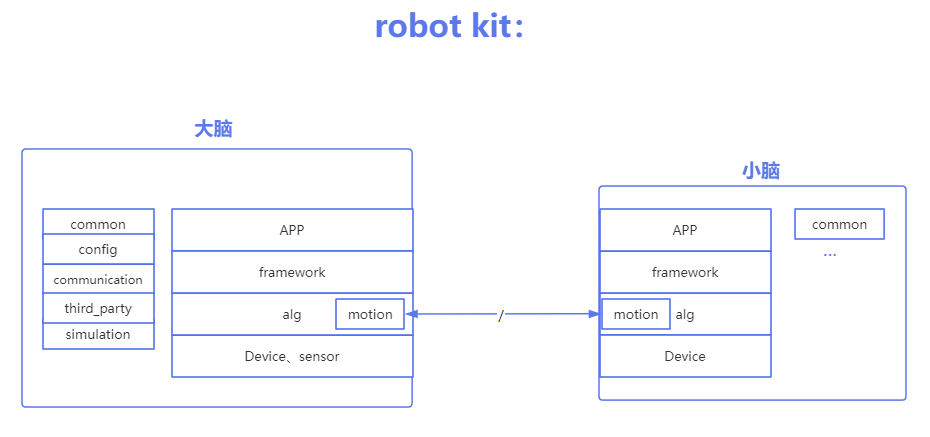
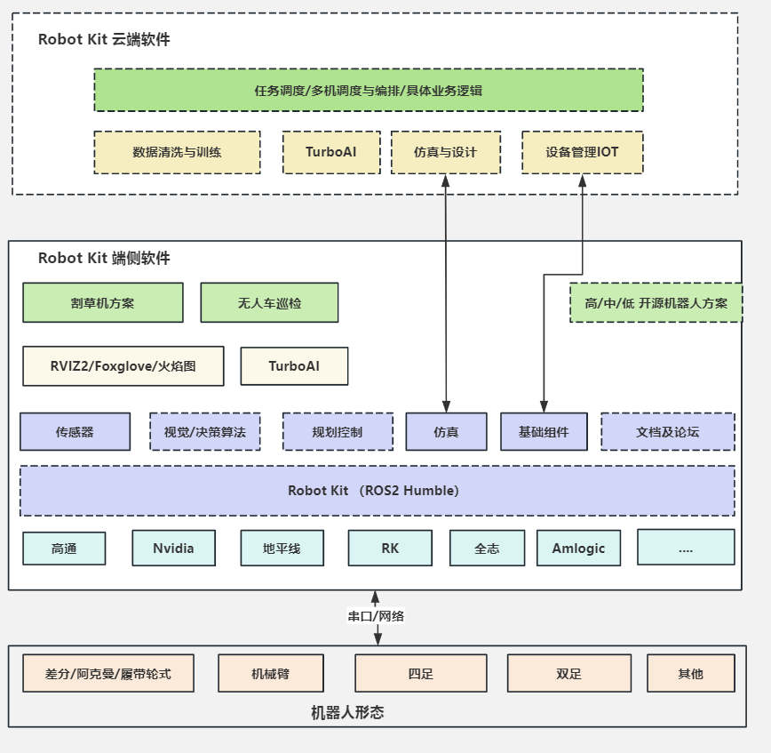

# 概述

robot_kit是奥比中光面向机器人厂商和生态开发者推出的机器人系统开发套件，包括开源机器人操作系统、深度感知算法及应用开发文档，旨在释放机器人场景的智能潜能，助力生态开发者和商业客户能够高效、便捷的进行机器人开发，打造具有竞争力的智能机器人产品。

# 功能介绍

robot_kit 工具包包括开发应用文档、开发源码sdk、工具集。

**核心功能：**

* 深度相机点云数据提供视觉场景的智慧感知
* 导航规划融合集成提供多场景复杂构图能力
* 各种外设生态传感器的灵活支持
* 多态机器人运动机构的支持
* 融合奥比生态的开源机器人操作系统

**亮点：**

* “效率”：提供最少层级、高性能获取设备数据的能力
* “灵活”：模块化传感器功能，灵活组合不同设备
* “高可扩展”：支持日益多样化形态的设备及系统，以及插件化算法适用于不同场景

**robot_kit中包含两个部分：**

| **内容**      | **描述**                                                                                                                                        |
| ------------- | ----------------------------------------------------------------------------------------------------------------------------------------------- |
| robot_sdk     | 大脑---应用板，基于视觉导航算法，融合奥比深度点云数据，提供机器人应用业务框架，支撑开发者二次开发强大的ai智能能力集，赋予机器人各种场景服务能力 |
| robot_control | 小脑---运动控制板，运行实时RTOS，集成MPC, IP运动控制算法，高实时对运动机构进行控制，支持两轮、四轮、四足、机械臂等运动机构                      |

# robot_kit框图

robot_kit 大脑与小脑框架示意图

robot_kit 端侧与云端框架示意图

