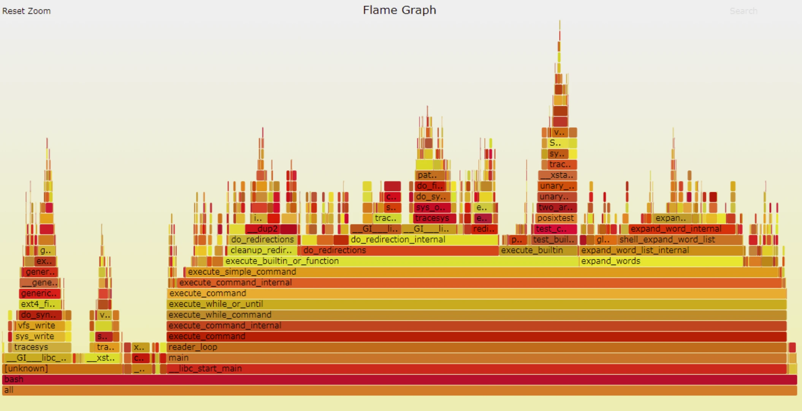

# FlameGraph火焰图

## 概述

火焰图是用图形化的方式来展现perf等工具采集的性能数据，对数据进行统计和分析，方便找出性能热点。



火焰图有以下特征（这里以 on-cpu 火焰图为例）：

* 每一列代表一个调用栈，每一个格子代表一个函数
* 纵轴展示了栈的深度，按照调用关系从下到上排列。最顶上格子代表采样时，正在占用 cpu 的函数。
* 横轴的意义是指：火焰图将采集的多个调用栈信息，通过按字母横向排序的方式将众多信息聚合在一起。需要注意的是它并不代表时间。
* 横轴格子的宽度代表其在采样中出现频率，所以一个格子的宽度越大，说明它是瓶颈原因的可能性就越大。
* 火焰图格子的颜色是随机的暖色调，方便区分各个调用信息。
* 其他的采样方式也可以使用火焰图， on-cpu 火焰图横轴是指 cpu 占用时间，off-cpu 火焰图横轴则代表阻塞时间。
* 采样可以是单线程、多线程、多进程甚至是多 host

代码仓库：[https://github.com/brendangregg/FlameGraph.git](https://github.com/brendangregg/FlameGraph.git)


## 准备工作


1. flamegraph工具分为两个部分，第一部分是可执行程序perf。perf是一款进行软件性能分析的工具，用于统计并输出系统或某一进程内的函数调用情况。perf工具地平线RDK的操作系统已经自带了，所以直接使用即可。
2. flamegraph工具的第二部分是解析perf文本的脚本，脚本用于解析perf统计的文本数据，生成SVG格式的函数调用火焰图，方便观察和分析。

## 使用介绍

1. 使用perf record工具采样地平线RDK系统内的函数调用情况，生成perf.data文件

```
root@ubuntu:~# perf record -F 99 -a -g -- sleep 60
```

2. 使用perf script 解析perf.data文件生成out.perf

```
root@ubuntu:~# perf script > out.perf
```

3. 在PC或者上 git clone https://github.com/brendangregg/FlameGraph.git，进入flamegraph目录，使用flamegraph工具包内的stackcollapse-perf.pl 对out.perf 反折叠生成out.folded

```
./stackcollapse-perf.pl out.perf > out.folded
```

4. 使用flamegraph.pl 生成svg火焰图

```
./flamegraph.pl out.folded > flame.svg
```

其中1，2步骤在设备上完成，3，4步骤在PC或者设备上完成。

## 结果分析

经过前一节的使用流程，记录下来的系统内的函数调用如下图所示


