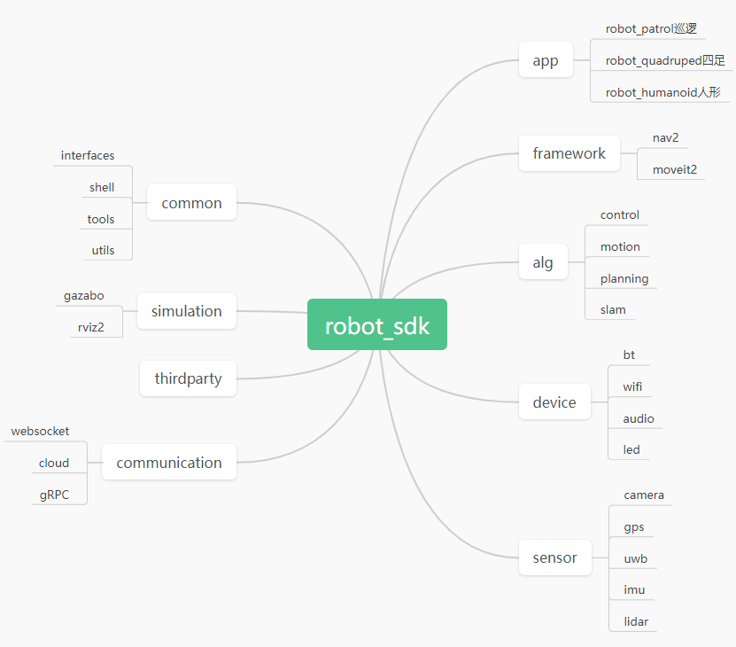

# Robot SDK概述

RobotSDK ---- 大脑应用板/主板，为robot_kit/rotot_sdk部分:

大脑基于视觉导航算法，融合奥比深度点云数据，提供机器人应用业务框架，支撑开发者二次开发强大的ai智能能力集，赋予机器人各种场景服务能力

 

**RobotSDK提供app sample支持机器人类型为：**

* Quadruped robot 四足仿生机器人
* Food Delivered services robot  送餐服务机器人
* Industrial robotic arm services robot  工业协作定制服务机器人

 
 

**RobotSDK 依据运动机构分类，支持运动机构类型为：**

* 两轮/差分/阿克曼
* 四足
* 机械臂

运动机构由大脑经由外部通信，传输控制指令给小脑，小脑专注提供实时复杂运动控制能力给到机器人支撑

 

依据RobotSDK提供的组件各种能力的融合，开发者可以为产品定制化各种类型功能
app/xxx/onfig 提供灵活的配置选择，开发者也可在此配置选项的基础上进行深度定制集成

 
 
 
 

**Robot SDK 软件目录**

