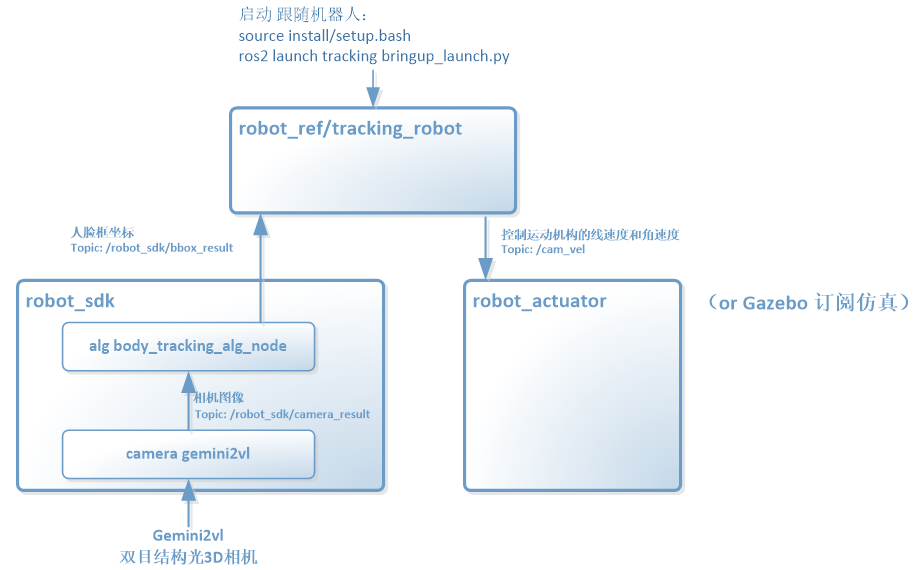

# Tracking robot 跟随机器人

## 功能说明：

通过视觉进行人脸目标检测与跟踪，并生成运动控制指令控制机器人自动跟随目标运动。该功能支持机器人实物和Gazebo仿真两种体验方式。

## 机器人实物：

| 设备名称             | 生产厂家 | 作用                                 | 参考链接                                |
| :--------------------- | ---------- | -------------------------------------- | ----------------------------------------- |
| Orbbec Gemini2vl相机 | 奥比中光 | 3D结构光深度视觉相机，点云数据输入源 | https://item.jd.com/10085187988079.html |
|                      |          |                                      |                                         |

## 应用说明：

运行本应用示例，可以通过摄像头识别到人脸，从而控制小车运动轨迹，通过foxglove可以查看摄像头识别人脸框的情况，通过gazebo可以模拟演示人脸移动控制小车运动情况

原理框图

### 功能包安装

1、安装gazebo

2、安装foxglove

或直接采用奥比附带提供的docker环境

### 编译

在kit目录下全编译 colcon build   （包含ref、sdk包）

### 运行

1、确保设备连接上gemini摄像头

2、source install/setup.bash  (若设备执行器是zsh，则使用source install/setup.zsh)

3、ros2 launch bringup bringup_launch.py

 

此时launch启动应用，并自动打开gazebo，加载两轮差速小车模型（设备需要安装好gazebo和小车模型）

 

控制方法：识别到人脸，根据人脸的移动方向控制机器人底盘做前进后退转弯运动（在gazebo画面中仿真）：

人脸向上移动-----小车前进

人脸向下移动-----小车后退

人脸向左移动-----小车左转弯

人脸向右移动-----小车右转弯

 

原理，tracking实现判断人脸移动方向趋势，通过发布发布话题/cmd_vel，以控制底盘移动

 

### 仿真

通过foxglove可以查看摄像头识别人脸框的情况，通过gazebo可以模拟演示人脸移动控制小车运动情况

 

## 详细代码开发说明：

参考章节：

人体人脸跟随应用示例app说明：[robot_ref/tracking_robot](README.md)

人体人脸识别算法说明：[alg/body_tracking_alg](../../robot_sdk/alg/body_tracking_alg/README.md)

Gemini2vl摄像头sdk说明：[sensor/camera/src/gemini2vl](../../robot_sdk/sensor/camera/src/gemini2vl/README.md)

## 常见问题：

1、人脸识别跟随，使用gazebo仿真和真实机器人仿真存在差异，区别是真实机器人摄像头可以跟随着人脸转动对焦中心坐标

2、通过foxglove可以查看摄像头识别人脸框的情况，通过gazebo可以模拟演示人脸移动控制小车运动情况。

3、若重新打开camera遇到异常，为上一次异常退出导致，这时尝试拔下camera usb重新上电重启
